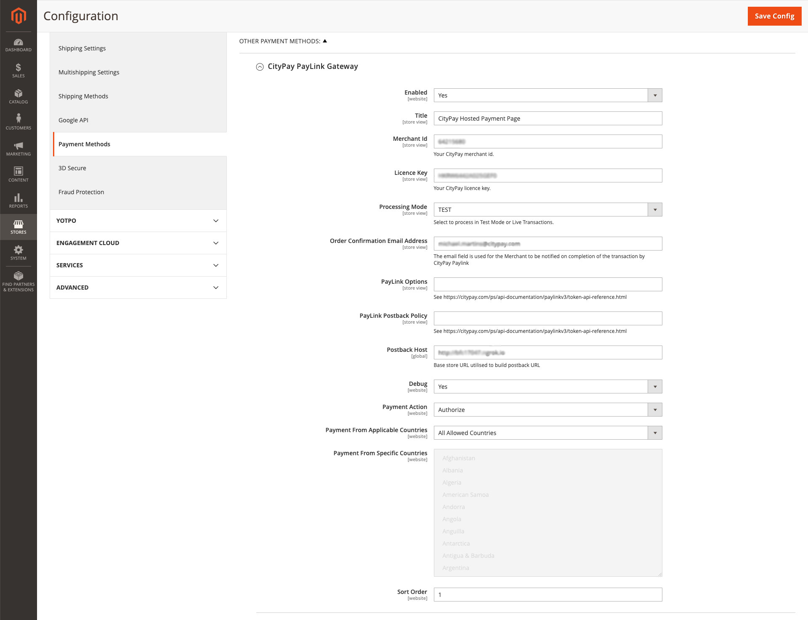
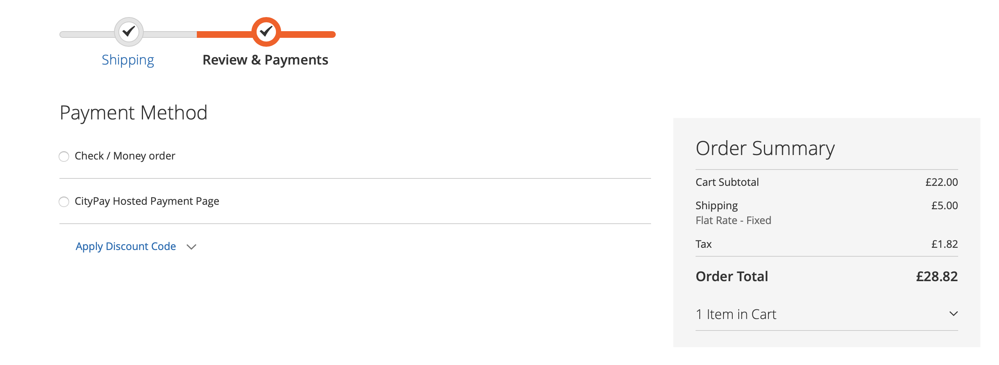
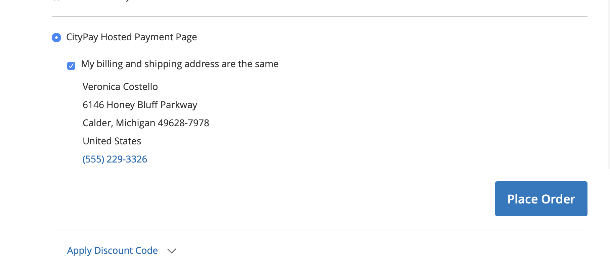
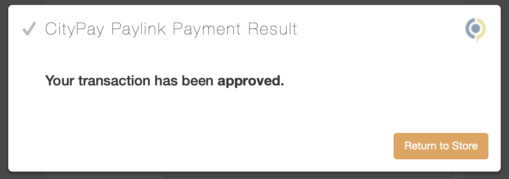
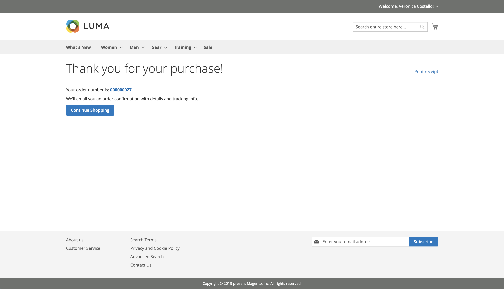
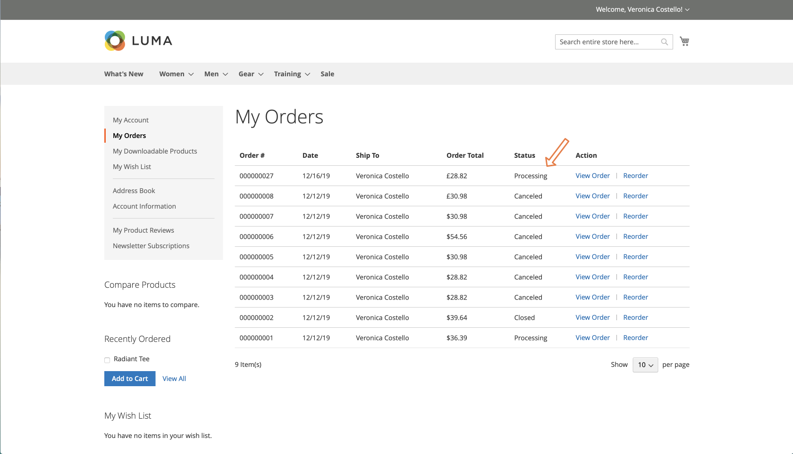
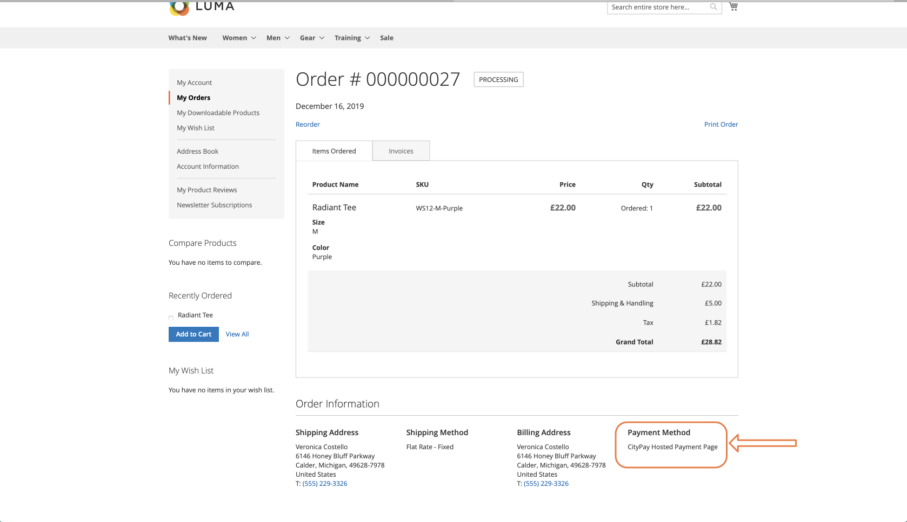
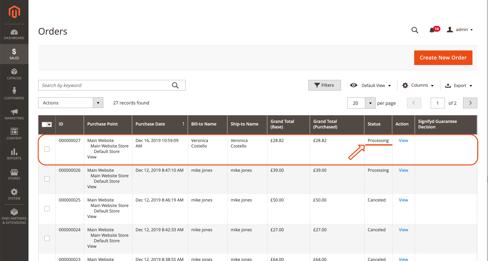
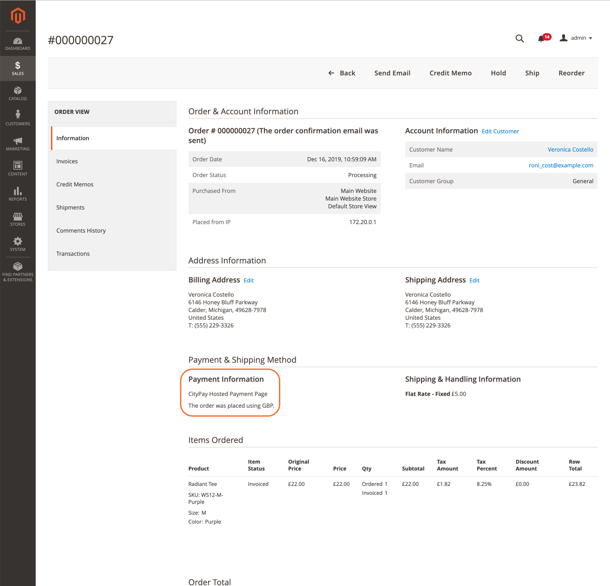

<!---->

     
# Magento 2 Payment Module

CityPay Paylink Magento 2 Payment Module is a secure payment method in your Magento2 webshop. Integrating CityPay Paylink with Magento 2 is fast and easy.

To make payments in your Magento 2 webshop, download the CityPay Paylink Magento 2 module here and you will be able to offer a vast variety of most 
frequently used national and international online payment methods and solutions for worldwide internet commerce.

## Installing CityPay Paylink Payment Module

0. Download this project as a .zip file
0. Change to directory where magento is installed (i.e cd /var/www/html/)
0. Expand your magento2 composer.json file (i.e /var/www/html/composer.json) with the "repositories" block bellow:
    ```json
    "repositories": {
     "0":   {
            "type": "composer",
            "url": "https://repo.magento.com/"
        },
		"citypay-paylink":{
			"type":"package",
			"package":{
			    "name": "citypay/module-paylink",
				"description": "CityPay Paylink hosted payment page",
				"require": {
					"php": "~5.5.0|~5.6.0|~7.0.0|~7.1.0|~7.2.0",
					"magento/module-sales": "102.0.*",
					"magento/module-checkout": "100.3.*",
					"magento/module-payment": "100.3.*",
					"magento/framework": "102.0.*",
					"magento/magento-composer-installer": "0.1.13"
				},
				"type": "magento2-module",
				"version": "100.0.3",
				"license": [
					"OSL-3.0",
					"AFL-3.0"
				],
				"autoload": {
					"files": [ "registration.php" ],
					"psr-4": {
						"CityPay\\Paylink\\": ""
					}
				},
				"dist":{
					"type":"zip",
					"url":"~/Paylink.zip"
				}
			}
		}
    },
    ```
0. Run composer update
0. Run composer require -vvv citypay/module-paylink=100.0.3
0. Ensure that the plugin is enabled (i.e using Magento CLI -> magento module:enable CityPay_Paylink)

## User Documentation

### Configuring the payment module
To configure the module, log in to your administrator backend.

1. Go to **Stores** -> **Configuration** -> **Sales** -> **Payment methods** and find and click on **CityPay Paylink Gateway** Settings under **OTHER PAYMENT METHODS**



### Merchant required settings
To be able to use the CityPay Paylink Plugin the merchant must configure their following **Required** fields:
 - **Licence Key** (CityPay Client LK)
 - **Merchant Id** (CityPay Merchant Id)
 - **Order Confirmation Email Address** (email to which the merchant receipt email go to)
 - **Postback Host** (Internet accessible Base URL for the magento store so that postback can be handled and order status can be updated)
    *if using localhost in development we suggest using a product like ngrok to create a tunnel so that our postbacks 
    are remotely accessible through the internet.
 - **Processing Mode** (Select TEST to process in test mode or LIVE to perform Live Transactions)

## Customer Experience

### Checkout
- Customer will be presented with the option to pay via CityPay Hosted Payment Form


___


___
### Paylink Payment Form

- Customer will be presented with the CityPay Paylink Form


___

### Post Processing
- Customer will be redirected back to Magento Store once they hit the *Return to Store* button


___


___
- Customers order summary will mention order status as *Processing*


___
- Order details page will display CityPay Payment as the Payment Method


___

## Admin Experience

### Orders 

- Order will be set to Processing on the Merchant Backend Console and Merchant 
will have the ability to view that the payment was made by the CityPay Payment Module.


___


